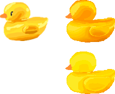

# 🎨 오늘의 연습: 2026-04-15

## 📋 연습 테마 : 노랑 채색 연습 : 장난감 오리
- 채색 중

---
### ✍️ 오늘의 메모
- 병아리 캐릭터 보다 쉬울 줄 알고 장난감 오리를 했는데, 생각을 잘못했다. 형태감이 복잡한 것을 생각을 못했다. 
- 형태감도 다음에 신경써서 골라야겠다. 일단 해야지.
- 색 이론 배운 것을 하니까 대가리와 날개가 주황색이 되가고 있다는 것이 눈에 띄어서, 다시 수정하고 있다.
- 색은 색이고, 입체감, 형태감은 또 채색을 어떻게 하느냐에 따라 다르구나를 다시 깨달았다. 색만 신경쓰다가 형태가 무너지기도 했다.
